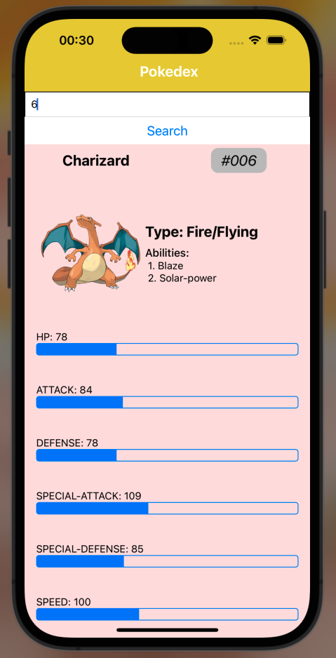
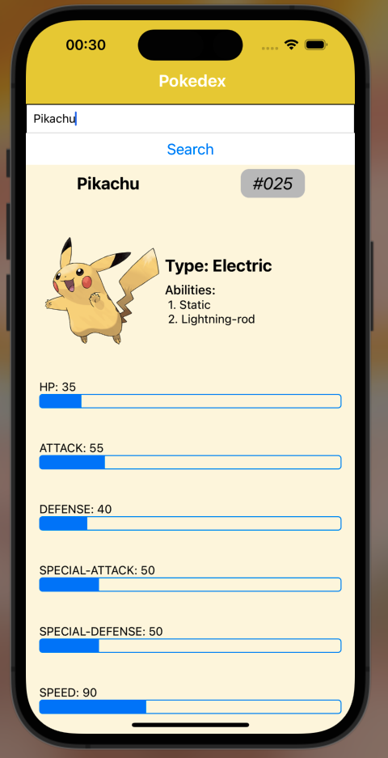

# Pokedex - with PokeAPI

Having fun with the PokeAPI - A script that allows the user to retrieve a Pokedex-like entry for a Pokemon.
Data supports Pokemon from Gen 1 to Gen 8, including Pokemon from the Sword and Shield DLC

This was done using both Python and Javascipt with a few variations.

Navigate the three projects:

1. [Python](/Python/)
1. [JS](/Website/)
1. [React Native App](/App/)

---

# 🐍 Python

## How we did it

1. Navigate to PokeAPI page and go to the [API v2 Tab](https://pokeapi.co).
   The documentation will have many endpoints, from Berries to Evolution chain.

2.

- Call the _getPokemon_ method to get a Pokedex entry for a given Pokemon Dex number or Pokemon name

  ```
  entry = dex.getPokemon('Mewtwo')

  output:

  #150
  Mewtwo
  Single Type Psychic Pokemon
  Ability: 1. Pressure
  Hidden Ability: Unnerve
  Native Generation: Kanto
  ```

  Nothing is currently returned from this function, just printed.

- Call the _getStats_ method to get a full list of Pokemon with they types and sum of their base stats. The user can also filter down to what Primary type they want by setting a PokeType as an argument

  ```
  waterType = dex.getStats('Water')
  ```

---

# 💻 JavaScript

If you want to see the Webpage in action:

- Install the _Live Server_ extension in VSCode
- Download the repo and navigate to the home.html file
- Right click and _Open with Live Server_

## How we did it

### Home

1. Navigate to PokeAPI page and go to the API v2 Tab. The documentation will have many endpoints, from Berries to Evolution chain.

1. Create a function _getPokemon_ to retrieve one pokemon from the API

   ```
   const getPokemon = async id => {
     const url = `https://pokeapi.co/api/v2/pokemon/${id}`;
     const result = await fetch(url);
     const pokemon = await result.json();
     console.log(pokemon)
     createPokeCard(pokemon);
   }

   ```

- This async function allows us to interact with the API and simultaneously complete other tasks like rendering web pages etc. The `await` key word will pause the execution and evaluate the value brought back.

1. Create a function _fetchPokemon_ to iterate through all numbers to bring back multiple repsonses

   ```
   const fetchPokemon = async() => {

     for (let i =1; i <= pokemon_number; i++){
         await getPokemon(i);
         }
   };
   ```

- This function will use a for loop to iterate until the max `pokemon_number` is brought back

1. Create a function _createPokeCard_ to take the json response, parse it and assign values to appropriate variables. The innerHTML method allows us to set HTML content for an element in JS.


### PokeDex Search

1. Create a function _performSearch_ that is call the _getPokemon_ function once the search button is clicked


---

# 📱 React Native

## How we did it

This takes alot of the learning from the Javascript implementation

1. We have to initate our App

```
export default function App() {
  // code to render on app screen
}
```

2. In order to interact with our app, we'll have a text input component, which will capture an input at a certain _state_ and update the values to interact with other functions in our code

```
const [mon, setMon] = useState('')
```

- Here, the `useState` hook allows us to define the value of our output: _mon_, which will be a json object from out API. The _setMon_ element is a function, that will be called to update the value after a given input. The input from the user will be a number (dex Number) or the name of the Pokemon

| Charizard via Dex Number |  Pikachu via Name  |
| :----------------------: | :----------------: |
|        |  |
